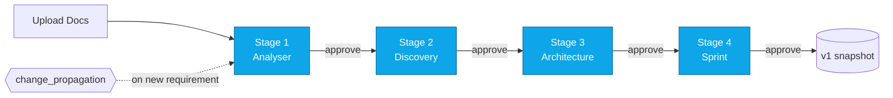
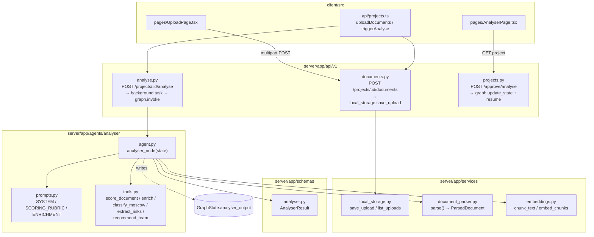
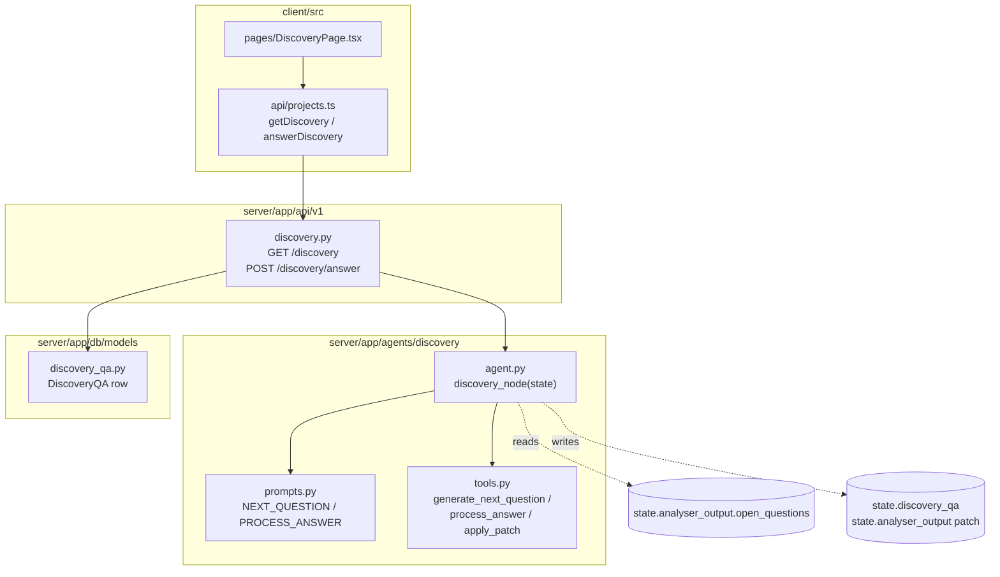
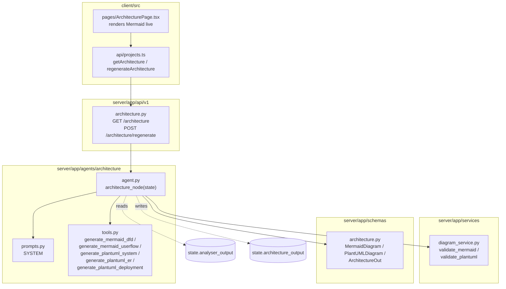
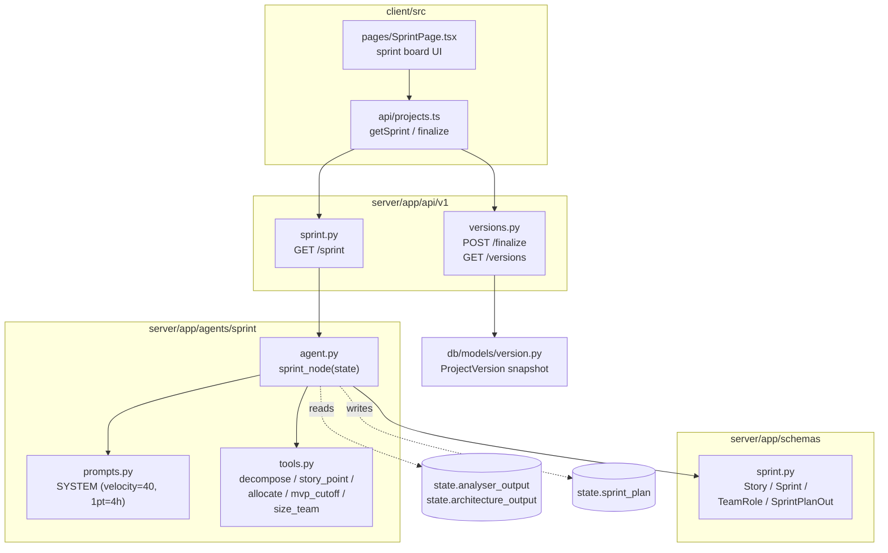

# BRA Tool — Business Requirement Analysis Tool

> **AI-Powered Multi-Agent Platform for Product Teams**
> Version 1.0 — Draft · April 20, 2026
> Stack: **LangGraph · FastAPI · React · SQLite (local) · Tailwind + shadcn/ui**
> Classification: Internal — Product & Engineering

---

## 📁 Monorepo Structure

```
tricon/
├── client/                  # React 18 + TS + Vite + Tailwind + shadcn/ui
│   ├── src/
│   │   ├── api/             # HTTP + WebSocket client wrappers
│   │   ├── components/      # Reusable components (shadcn lives here too)
│   │   ├── pages/           # Route-level pages (one per pipeline stage)
│   │   ├── store/           # Zustand stores (global app state)
│   │   ├── hooks/           # Custom React hooks
│   │   ├── lib/             # utils (cn helper for Tailwind class merging)
│   │   ├── types/           # TS types mirroring backend schemas
│   │   └── utils/           # Misc helpers
│   ├── components.json      # shadcn/ui registry config
│   ├── tailwind.config.ts
│   └── ...
│
├── server/                  # FastAPI + Python 3.11 (runs entirely locally)
│   ├── app/
│   │   ├── main.py          # FastAPI app factory + startup lifecycle
│   │   ├── core/            # Config + logging
│   │   ├── api/v1/          # REST + WS route handlers (one file per resource)
│   │   ├── agents/          # LangGraph agents (analyser, discovery, architecture, sprint)
│   │   ├── services/        # Business logic (parsing, diagrams, exports, local storage)
│   │   ├── db/              # SQLAlchemy session + ORM models (SQLite default)
│   │   └── schemas/         # Pydantic request/response models
│   ├── uploads/             # Created at runtime — raw files per project (git-ignored)
│   ├── exports/             # Created at runtime — generated PDF/DOCX (git-ignored)
│   ├── requirements.txt
│   └── README.md
│
├── .gitignore
└── README.md                # ← You are here
```

### TODOs Cheat Sheet

| Task | Go to |
|------|-------|
| Add a new REST endpoint | `server/app/api/v1/<resource>.py` |
| Change an LLM prompt | `server/app/agents/<agent>/prompts.py` |
| Add a new agent tool | `server/app/agents/<agent>/tools.py` |
| Edit the LangGraph wiring | `server/app/agents/graph.py` |
| Add a database table | `server/app/db/models/<table>.py` + add to `models/__init__.py` |
| Add a request/response model | `server/app/schemas/<resource>.py` |
| Parse a new file format | `server/app/services/document_parser.py` |
| Add a frontend page | `client/src/pages/` and register in `App.tsx` |
| Call a backend API | `client/src/api/<resource>.ts` |
| Add a shadcn component | `cd client && npx shadcn@latest add <component>` |
| Add shared app state | `client/src/store/` (Zustand) |

---

## ❓ FAQ

### Q: Don't we need routers in the backend?
**Yes — and they are already there.** Every file in `server/app/api/v1/` exposes
a FastAPI `APIRouter`, and `server/app/api/v1/router.py` aggregates them into a
single `api_router` that `main.py` mounts under `/api`. See the
[server module README](server/app/api/v1/README.md) for the full list.

### Q: Where is the data stored?
- **Structured data** (projects, stage outputs, Q&A, versions) → SQLite file
  `server/bra_tool.db` (auto-created on first run). Change `DATABASE_URL` in
  `.env` to point at local Postgres later.
- **Uploaded documents** → `server/uploads/<project_id>/<filename>` on disk.
- **Exported PDFs/DOCXs** → `server/exports/<project_id>/<stage>.<ext>`.

### Q: Do I need Docker or Java?
**No.** Everything runs locally. Mermaid diagrams render in the browser and
PlantUML DSL is returned to the frontend (rendered client-side via the public
PlantUML service or a local Kroki later — no Java needed on dev machines).

### Q: Where is authentication?
**Deliberately removed for now.** We will add it later (likely JWT or session
cookies). Route handlers have no `current_user` dependency today.

---

## 🚀 Quick Start

### Prerequisites
- **Node.js** ≥ 20
- **Python** 3.11

### 1. Server

```bash
cd server
python3.11 -m venv .venv
source .venv/bin/activate
pip install -r requirements.txt
cp .env.example .env                      # fill in OPENAI_API_KEY etc.
uvicorn app.main:app --reload --port 8000
```
API docs: <http://localhost:8000/docs>

### 2. Client

```bash
cd client
npm install
cp .env.example .env
npm run dev
```
Web app: <http://localhost:5173>

---

## 🧠 Pipeline at a Glance



Each stage is a **LangGraph node**; each approval is an `interrupt_before`
checkpoint. See [server/app/agents/graph.py](server/app/agents/graph.py).

---

## 🏗️ Per-Stage Architecture Diagrams

These diagrams show **which file you edit to change a given behaviour**.
Every box is a real filename or function — click through in your IDE.

### Stage 1 — Document Analyser



**How to work on Stage 1:**
1. Change *scoring weights* → `agents/analyser/tools.py::SCORING_WEIGHTS`
2. Change *prompt wording* → `agents/analyser/prompts.py`
3. Add a new *stage output field* → update `schemas/analyser.py::AnalyserResult`
   then extend `analyser_node` to populate it
4. Add a new *parsed file format* → add a branch in `services/document_parser.py`

---

### Stage 2 — Discovery / QnA



**How to work on Stage 2:**
1. Change *question phrasing* → `agents/discovery/prompts.py::NEXT_QUESTION`
2. Change how an *answer updates* the analyser output → `agents/discovery/tools.py::process_answer` + `apply_patch`
3. Change how Q&A is *stored* → `db/models/discovery_qa.py`

---

### Stage 3 — Architecture



**How to work on Stage 3:**
1. Change a *diagram type* or *DSL style* → `agents/architecture/tools.py`
2. Change *validation rules* → `services/diagram_service.py`
3. Add a *new diagram type* → extend `tools.py` + `schemas/architecture.py` + render in `pages/ArchitecturePage.tsx`

---

### Stage 4 — Sprint Planning



**How to work on Stage 4:**
1. Change *velocity* or *points-to-hours* ratio → `agents/sprint/prompts.py::SYSTEM`
   and `agents/sprint/tools.py::allocate(velocity=...)`
2. Change *MVP cut-off logic* → `agents/sprint/tools.py::mvp_cutoff`
3. Change *snapshot shape* → `db/models/version.py` + `api/v1/versions.py::finalize`

---

## 📄 Original BRD (Preserved Verbatim)

> The text below is the complete Business Requirements Document attached to
> this project. **Do not delete.** Update only via a versioned PR with
> stakeholder sign-off.

### BRA TOOL — CONFIDENTIAL & INTERNAL

**Business Requirement Analysis Tool**
*BRD + Technical Architecture Document*
AI-Powered Multi-Agent Platform for Product Teams

| Version | Date | Author | Classification | Stack |
|---------|------|--------|----------------|-------|
| 1.0 — Draft | April 20, 2026 | Varun | Internal — Product & Engineering | LangGraph · FastAPI · React/Angular · PostgreSQL · pgvector |

> **AI-Powered · Human-Approved · Version-Controlled**

### 1. Executive Summary

The Business Requirement Analysis (BRA) Tool is an internal AI-powered platform designed to automate the multi-stage process that product managers and business analysts perform when a new client engagement begins. Instead of manually producing discovery notes, architecture diagrams, and sprint plans, the product person uploads one or more client requirement documents and the platform orchestrates a pipeline of specialised LLM agents to produce structured deliverables at each stage.

Human-in-the-loop approval gates separate every stage. No agent moves forward without an explicit sign-off, ensuring the product person retains full control. All work is versioned so that evolving client requirements can be layered as v2, v3 iterations on top of a frozen baseline.

#### 1.1 Key Highlights
- **Multi-agent orchestration:** Four specialised agents (Analyser, Discovery/QnA, Architecture, Sprint Planner) orchestrated via LangGraph with inter-agent communication.
- **Human approval gates:** Product person reviews and approves output at every stage before the pipeline advances.
- **Multi-format document ingestion:** Accepts PDF, DOCX, DOC, PPT, PPTX, XLSX, XLS up to 50 MB per file; multiple files allowed; structured/unstructured content including images, tables, and links.
- **Configurable LLM per agent:** Each agent has an independent model selector in the UI settings panel — switch between OpenAI, Anthropic Claude, or other providers without code changes.
- **Architecture diagrams:** Stage 3 generates both Mermaid.js and PlantUML diagrams rendered live in the browser.
- **Version management:** Requirement changes at any stage trigger a re-run delta across all downstream stages; finalized versions are snapshotted as v1, v2, v3, etc.
- **Export capability:** Outputs from every stage are exportable as PDF or DOCX.

### 2. Project Goals & Scope

#### 2.1 Goals
- Reduce the time a product manager spends on initial requirement analysis from days to hours.
- Standardise deliverable quality across all client engagements.
- Capture open questions, risks, and scope boundaries early in the engagement lifecycle.
- Enable requirement traceability from raw document through to sprint tasks.
- Provide full audit history with version snapshots for contractual and governance purposes.

#### 2.2 In Scope
- Document upload and ingestion pipeline (PDF, DOCX, PPTX, XLSX, images inside documents).
- Document Analyser Agent — scoring, enrichment, and structured output generation.
- Discovery / QnA Agent — dynamic question generation and interactive Q&A workflow.
- Architecture Agent — HLD diagram generation using Mermaid.js and PlantUML.
- Sprint Planning Agent — sprint breakdown with story points and man-hours.
- Human-in-the-loop approval at every stage with inline editing capability.
- Multi-LLM configuration per agent with runtime switching.
- Versioning system (v1, v2, ...) with delta re-processing on requirement changes.
- Export to PDF and DOCX for all stage outputs.
- PostgreSQL for structured data + pgvector / Qdrant for semantic document retrieval.
- FastAPI backend with REST + WebSocket endpoints.
- React or Angular frontend (framework decision deferred — **this repo uses React**).

#### 2.3 Out of Scope
- Real-time client collaboration portal (client-facing UI).
- Automated code generation or ticket creation in Jira/Linear.
- Fine-tuning or training custom LLM models.
- Mobile application.
- Multi-tenant SaaS billing or subscription management.
- Integration with specific CRM systems (Salesforce, HubSpot) in v1.

### 3. Stakeholders & User Personas

| Role | Responsibility | Interaction with Tool |
|------|---------------|-----------------------|
| Product Manager / BA | Primary user; first point of contact with client | Uploads docs, reviews & approves each stage output |
| Technical Lead / Architect | Reviews architecture diagrams and technical decisions | Consumes Stage 3 output; may co-approve |
| Project Manager | Reviews sprint plan and resource estimates | Consumes Stage 4 output; owns timeline |
| Client | Provides high-level requirement documents | Indirect — answers fed into Discovery stage |
| System Admin | Manages LLM API keys and platform config | Admin panel for model settings and user management |

### 4. Functional Requirements

#### 4.1 Document Upload & Input Panel

**Must Have**
- Multi-file uploader accepting PDF, DOC, DOCX, PPT, PPTX, XLS, XLSX.
- Maximum 50 MB per file; multiple files allowed in one session.
- Structured and unstructured content support: images, tables, embedded links.
- Free-text textarea alongside uploader for additional context, instructions, or raw requirement text.
- Upload progress indicator and file validation feedback.
- Ability to add/remove files before triggering analysis.

**Should Have**
- Drag-and-drop upload interface.
- Preview panel showing extracted text/tables from uploaded files.
- Option to paste a public URL for web-hosted documents.

#### 4.2 Stage 1 — Document Analyser Agent

The Analyser Agent is the entry point to the pipeline. It parses all uploaded documents, evaluates their completeness, and produces a structured analysis report.

**Scoring Criteria**

| Criterion | Weight | Description |
|-----------|:------:|-------------|
| Functional Requirements | 20% | Are user stories or feature descriptions present? |
| Business Logic / Rules | 15% | Are business rules, workflows, or constraints described? |
| Existing Product / System Info | 15% | Context about current systems or legacy integrations |
| Target Audience / Users | 10% | Persona or user segment definition |
| Architecture / Technical Context | 15% | Any existing tech stack, infra, or constraints |
| Non-Functional Requirements | 10% | Performance, security, scalability expectations |
| Timeline / Budget Signals | 10% | Delivery expectations or resource constraints |
| Visual Assets (Diagrams/Flows) | 5% | Wireframes, mockups, flow diagrams included |

**Score-Based Routing Logic**
- **Score 1–5 out of 10:** Document is insufficient. The agent automatically enriches it using LLM inference — filling gaps, inferring implied requirements, and flagging assumptions. The enriched version is presented for review before moving on.
- **Score 6–10 out of 10:** Document is sufficient. The agent proceeds directly to structured output generation without enrichment.

**Stage 1 Outputs (Must Have)**
1. Executive Summary — 2–3 paragraph overview of the engagement.
2. Project Overview — Objective, Scope, Out-of-Scope.
3. Functional Requirements — categorised as Must Have / Should Have / Good to Have (MoSCoW).
4. Identified Risks — technical, business, and delivery risks.
5. Recommended Team — suggested roles and rough team size.
6. Open Questions for Client — unanswered items surfaced for Stage 2.
7. Document Completeness Score — numeric score with per-criterion breakdown.

All outputs are editable inline by the product person before approval. Export to PDF/DOCX available at this stage.

#### 4.3 Stage 2 — Discovery / QnA Agent

The Discovery Agent conducts a structured Q&A session to surface ambiguities and deepen the requirement understanding. It communicates back to the Analyser Agent to update the Stage 1 analysis based on answers received.

**Behaviour**
- Questions are generated one at a time based on open questions from Stage 1 and gaps in the document.
- Product person can answer directly, defer the question (add to 'Ask Client' backlog), or mark as 'Not Applicable'.
- Answered questions trigger a delta update back to the Stage 1 Analyser Agent — the analysis report is updated in real time.
- Unanswered / deferred questions are grouped into an 'Open Questions for Client' section preserved for future sessions.
- Agent adapts follow-up questions based on prior answers within the session.
- Session can be paused and resumed; partial answers are saved.

#### 4.4 Stage 3 — Architecture Agent

Based on the finalised requirement analysis from Stages 1 and 2, the Architecture Agent generates high-level architecture and user flow diagrams.

**Diagram Types**

| Diagram | Tool | Purpose |
|---------|------|---------|
| System Architecture | PlantUML | Component-level view: services, databases, integrations, external APIs |
| Data Flow Diagram | Mermaid.js (flowchart) | How data moves between components |
| User Flow | Mermaid.js (sequence/state) | End-to-end user journey for key scenarios |
| Entity Relationship | PlantUML | Core data model if applicable |
| Deployment Architecture | PlantUML | Cloud/infra topology if deployment context is known |

**Rendering Approach**
- Mermaid.js diagrams are rendered live in the browser using the `mermaid` library — editable DSL with live preview.
- PlantUML diagrams are returned as DSL to the client and rendered client-side (no Java dependency in this repo).
- Both diagram types are downloadable as SVG/PNG and included in DOCX/PDF exports.

#### 4.5 Stage 4 — Sprint Planning Agent

The Sprint Planning Agent converts the finalised functional requirements into a detailed sprint plan with story points, man-hours, MVP scope, and team composition recommendations.

**Output Structure**

| Field | Example / Description |
|-------|----------------------|
| Total Sprints | 6 (2-week sprints = 12 weeks) |
| Total Story Points | 217 points across all sprints |
| Total Man Hours | 868 hours (across all roles) |
| MVP Cut-off | End of Sprint 4 — core features delivered |
| Sprint Goals | Per-sprint objective with feature list |
| Story Breakdown | User stories with acceptance criteria, points, and role assignment |
| Team Composition | FE Dev x2, BE Dev x2, QA x1, DevOps x1, PM x1 (example) |
| Technology Stack | Per-component technology recommendations |
| Risk Register | Updated risks post-planning with mitigation notes |

### 5. Non-Functional Requirements

| Category | Requirement |
|----------|-------------|
| Performance | Document processing (up to 50 MB) must complete within 60 seconds for Stage 1. |
| Scalability | System must support concurrent sessions for up to 50 simultaneous users. |
| Reliability | Agent pipeline must handle LLM timeouts with retry logic (max 3 retries, exponential backoff). |
| Security | LLM API keys stored encrypted; documents stored in encrypted-at-rest storage; role-based access control. |
| Auditability | All agent inputs/outputs logged with timestamps; version history immutable. |
| Availability | 99.5% uptime SLA for internal deployment. |
| Observability | Structured logging, agent trace IDs, LangSmith or equivalent tracing integration. |
| Portability | Docker Compose for local dev; Kubernetes-ready for production deployment. |

### 6. Technical Architecture

The system is built on a three-tier architecture: a React SPA frontend, a FastAPI Python backend, and a LangGraph-orchestrated agent layer backed by PostgreSQL + pgvector for persistence.

#### 6.1 High-Level Architecture Overview

```
┌──────────────────────────────────────────────────────────────┐
│  FRONTEND  (React + TypeScript)                              │
│  Upload UI · Stage Dashboards · Diagram Renderer · Export    │
└──────────────────┬───────────────────────────────────────────┘
                   │  REST + WebSocket (FastAPI)
┌──────────────────▼───────────────────────────────────────────┐
│  API LAYER  (FastAPI + Python 3.11)                          │
│  File Ingestion · Stage Routing · Export Service             │
└──────────────────┬───────────────────────────────────────────┘
                   │  LangGraph Graph Execution
┌──────────────────▼───────────────────────────────────────────┐
│  AGENT LAYER  (LangGraph + LangChain)                        │
│  Analyser Agent → Discovery Agent → Arch Agent → Sprint Agent│
│  Inter-agent messaging via LangGraph state & channels        │
└──────────────────┬───────────────────────────────────────────┘
                   │
┌──────────────────▼───────────────────────────────────────────┐
│  DATA LAYER                                                   │
│  SQLite (local file) · Local filesystem (uploads/ exports/)  │
└──────────────────────────────────────────────────────────────┘
```

#### 6.2 LangGraph Agent Graph Design

LangGraph is used to define the agent pipeline as a stateful directed graph. Each stage is a graph node. Edges represent either automatic progression or human approval checkpoints (`interrupt_before`). The global state object carries all artifacts between nodes.

**Graph State Schema**

```python
class GraphState(TypedDict):
    project_id:          str
    version:             int
    uploaded_documents:  list[DocumentChunk]
    additional_context:  str
    analyser_output:     AnalyserResult | None
    discovery_qa:        list[QAExchange]
    open_questions:      list[str]
    architecture_output: ArchitectureResult | None
    sprint_plan:         SprintPlan | None
    current_stage:       Literal['upload','analyse','discovery','architecture','sprint','finalized']
    approval_status:     dict[str, bool]
    llm_config:          dict[str, LLMConfig]
    change_log:          list[ChangeEvent]
```

**Graph Nodes & Edges**

| Node | Type | Description | Transition |
|------|------|-------------|------------|
| `document_ingestion` | Tool Node | Parse files, chunk text, extract tables/images | → `analyser_agent` |
| `analyser_agent` | LLM Node | Score document, enrich if needed, generate Stage 1 outputs | → `human_review_1` |
| `human_review_1` | Interrupt | Product person reviews, edits, approves Stage 1 output | → `discovery_agent` |
| `discovery_agent` | LLM Node | Generate Q&A, process answers, update analyser_output state | → `human_review_2` |
| `human_review_2` | Interrupt | Product person reviews discovery summary and open questions | → `architecture_agent` |
| `architecture_agent` | LLM Node | Generate Mermaid + PlantUML diagrams from final analysis | → `human_review_3` |
| `human_review_3` | Interrupt | Product person reviews diagrams, optionally requests regeneration | → `sprint_agent` |
| `sprint_agent` | LLM Node | Generate sprint plan, story breakdown, team recommendation | → `human_review_4` |
| `human_review_4` | Interrupt | Final approval — product person finalizes and versions | → `finalized` |
| `change_propagation` | Tool Node | On new requirement: delta re-run from affected stage onwards | → relevant stage |

#### 6.3 Agent Designs

##### 6.3.1 Document Analyser Agent
| Property | Detail |
|----------|--------|
| Default LLM | GPT-4o (configurable) |
| Tools Used | `FileParserTool`, `DocumentScorerTool`, `EnrichmentTool`, `MoSCoWClassifierTool`, `RiskExtractorTool`, `TeamRecommenderTool` |
| Prompt Strategy | Chain-of-thought scoring → structured JSON output via function calling / tool use. |
| Output Format | Structured JSON mapped to `AnalyserResult` schema; rendered as rich UI cards. |

##### 6.3.2 Discovery / QnA Agent
| Property | Detail |
|----------|--------|
| Default LLM | GPT-4o or Claude Sonnet (configurable) |
| Tools Used | `QuestionGeneratorTool`, `AnswerProcessorTool`, `StateUpdaterTool`, `OpenQuestionTrackerTool` |
| Prompt Strategy | Iterative: generate next question → await human answer → process → update state → repeat. |
| Output Format | List of `QAExchange` objects; updated `AnalyserResult` with delta changes highlighted. |

##### 6.3.3 Architecture Agent
| Property | Detail |
|----------|--------|
| Default LLM | GPT-4o or Claude Opus (configurable) |
| Tools Used | `MermaidGeneratorTool`, `PlantUMLGeneratorTool`, `DiagramValidatorTool`, `UserFlowExtractorTool` |
| Prompt Strategy | Decompose requirements → identify interactions → generate DSL → validate syntax → render. |
| Output Format | Mermaid DSL strings + PlantUML DSL strings; rendered as SVG in the browser. |

##### 6.3.4 Sprint Planning Agent
| Property | Detail |
|----------|--------|
| Default LLM | GPT-4o (configurable) |
| Tools Used | `StoryDecomposerTool`, `StoryPointerTool`, `SprintAllocatorTool`, `TeamSizerTool`, `MVPClassifierTool` |
| Prompt Strategy | Decompose features → epics → stories → tasks → estimate points → allocate → MVP boundary. |
| Output Format | `SprintPlan` JSON object; rendered as interactive sprint board in UI. |

#### 6.4 Inter-Agent Communication

Agents communicate via the shared LangGraph `StateGraph` state object. No direct agent-to-agent RPC is needed — state changes by one agent are immediately visible to the next. For the Discovery Agent's back-channel update to the Analyser output, a dedicated state key (`analyser_output`) is mutated and a `delta_changes` list tracks what changed and why.

### 7. API Design (FastAPI)

#### 7.1 REST Endpoints

| Method | Endpoint | Description |
|--------|----------|-------------|
| POST | `/api/projects` | Create new project session |
| GET | `/api/projects/{project_id}` | Get project with all stage outputs |
| POST | `/api/projects/{project_id}/documents` | Upload documents (multipart/form-data) |
| POST | `/api/projects/{project_id}/analyse` | Trigger Stage 1 — Analyser Agent |
| POST | `/api/projects/{project_id}/approve/{stage}` | Submit human approval with optional edits |
| GET | `/api/projects/{project_id}/discovery` | Get current Q&A state |
| POST | `/api/projects/{project_id}/discovery/answer` | Submit answer to current question |
| GET | `/api/projects/{project_id}/architecture` | Get diagram DSL and rendered SVGs |
| POST | `/api/projects/{project_id}/architecture/regenerate` | Request diagram regeneration |
| GET | `/api/projects/{project_id}/sprint` | Get sprint plan |
| POST | `/api/projects/{project_id}/finalize` | Finalize and create version snapshot |
| GET | `/api/projects/{project_id}/versions` | List all versions |
| POST | `/api/projects/{project_id}/export` | Export stage output as PDF/DOCX |
| GET | `/api/settings/llm-config` | Get LLM config per agent |
| PUT | `/api/settings/llm-config/{agent_id}` | Update LLM model for a specific agent |

#### 7.2 WebSocket Endpoint

```
WS /ws/projects/{project_id}/stream
```
Used for real-time streaming of agent output tokens to the frontend.
Events: `{ type: 'token' | 'stage_complete' | 'error' | 'question', payload: ... }`

### 8. Database Design

#### 8.1 PostgreSQL Schema (Core Tables)

| Table | Key Columns | Purpose |
|-------|-------------|---------|
| `projects` | id, name, status, current_stage, created_at | Top-level project entity |
| `project_versions` | id, project_id, version_number, snapshot_json, created_at | Immutable version snapshots |
| `documents` | id, project_id, filename, file_type, local_path, size_bytes, parsed_text, score | Uploaded documents metadata |
| `stage_outputs` | id, project_id, version, stage, output_json, approved_at, edits_json | Outputs for each pipeline stage |
| `discovery_qa` | id, project_id, question, answer, status (answered/deferred/na), created_at | Q&A exchange records |
| `change_events` | id, project_id, source_stage, description, triggered_at, reprocessed_stages | Requirement change tracking |
| `llm_configs` | id, agent_id, provider, model_name, temperature, max_tokens | Per-agent LLM configuration |

#### 8.2 pgvector — Semantic Search

| Table | Key Columns | Purpose |
|-------|-------------|---------|
| `document_chunks` | id, document_id, chunk_text, chunk_index, embedding (vector 1536) | Chunked document text |
| `requirement_nodes` | id, project_id, requirement_text, category, embedding (vector 1536) | Individual requirement items |

### 9. Technology Stack

| Layer | Technology | Justification |
|-------|------------|---------------|
| Agent Orchestration | LangGraph (LangChain ecosystem) | Stateful graph with native human-in-the-loop interrupt support |
| LLM Providers | OpenAI GPT-4o · Anthropic Claude · Pluggable via LangChain | Multi-model support; per-agent config |
| Backend Framework | FastAPI (Python 3.11) | Async-first, auto OpenAPI docs, WebSocket support |
| Document Parsing | PyMuPDF · python-docx · python-pptx · openpyxl | Handles all required file formats |
| Primary Database | SQLite (local) | Zero-setup for local dev; migrate to Postgres + pgvector later |
| Local Storage | Filesystem (`uploads/`, `exports/`) | Zero-setup; swap for S3 when deploying |
| Diagram Generation | Mermaid.js (browser) · PlantUML DSL (client-rendered) | No server-side Java required |
| Frontend | React 18 (TypeScript) | Modern, typed, fast dev loop |
| Frontend Styling | Tailwind CSS + shadcn/ui | Accessible, themeable primitives |
| Frontend State | Zustand | Predictable state for multi-stage wizard UI |
| Export | WeasyPrint (PDF) · python-docx (DOCX) | Server-side export generation |

### 10. Versioning & Change Management

Every finalized project state is snapshot as an immutable version record. When new requirements arrive, the product person adds them to the current session. The system identifies which stages are affected by the change and triggers a targeted re-run from the earliest impacted stage forward, while preserving all previous stage outputs until the re-run completes and is approved.

**Version Lifecycle**
1. Product person finalizes Stage 4 → system creates **v1** snapshot (immutable).
2. Client returns with updated requirements → product person adds new documents or text.
3. `change_propagation` node identifies delta impact (e.g., new feature affects Stages 1, 3, 4 but not 2).
4. Targeted re-run: affected agents re-execute with merged state (old + new requirements).
5. Product person approves each updated stage — creates **v2** snapshot on finalization.
6. Both v1 and v2 are accessible; diffs between versions are displayed in the UI.

### 11. Risks & Mitigations

| Risk | Impact | Likelihood | Mitigation |
|------|--------|------------|------------|
| LLM hallucination in requirements output | High | Medium | Structured JSON output with validation schema; human approval gate before any stage output is used downstream. |
| Large document processing timeout (>50 MB) | Medium | Medium | Async chunked processing with progress events; background job queue (Celery/ARQ). |
| LLM API rate limits under concurrent users | Medium | High | Per-agent rate limiter; request queuing; fallback model config. |
| Diagram DSL syntax errors (Mermaid/PlantUML) | Low | Medium | `DiagramValidatorTool` auto-corrects common syntax issues; fallback to simplified diagram on error. |
| User edits breaking downstream agent context | High | Low | Edit diffs stored separately; `change_propagation` re-runs affected stages with edited content merged into state. |
| Scope creep in multi-version projects | Medium | High | Strict version snapshotting; `change_log` provides full audit of every addition and its impact. |

---

## 📚 Further Reading

- **Server guide:** [server/README.md](server/README.md)
- **API routers:** [server/app/api/v1/README.md](server/app/api/v1/README.md)
- **Agents:** [server/app/agents/README.md](server/app/agents/README.md)
- **Services:** [server/app/services/README.md](server/app/services/README.md)
- **DB models:** [server/app/db/README.md](server/app/db/README.md)
- **Schemas:** [server/app/schemas/README.md](server/app/schemas/README.md)
- **Client:** [client/README.md](client/README.md)
